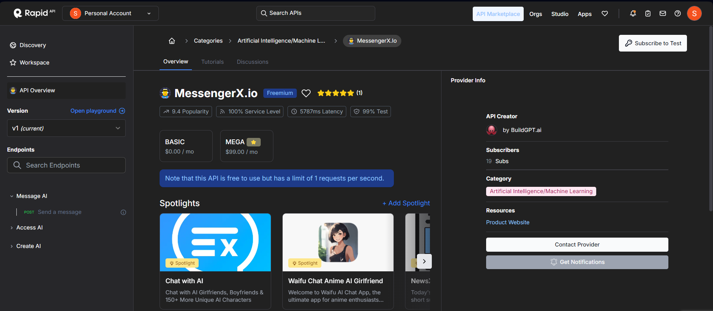

## Generate a RapidAPI key
1. Create your AI character via https://portal.messengerx.io
2. Get a [MessengerX API](https://rapidapi.com/buildgpt-labs-buildgpt-labs-default/api/messengerx-io) Rapid API key

3. Follow the steps below to launch your character on Telegram

## Create a Telegram Bot
1. Go to [Telegram apps](https://my.telegram.org/apps) and create an app
2. You'll get an ```App api_id``` and ```App api_hash```
3. Open the Telegram app and search for the ```BotFather``` bot
4. Start a chat with the BotFather and use the “/newbot” command to create a new bot
5. Follow the instructions from the BotFather to choose a name and username for your bot
6. Once the bot is created, ```BotFather``` will provide you with a unique ```Bot token``` for your bot. Make sure to keep this token safe, as it will be used to authenticate your bot when making API calls.

## Local Setup ##
### Download or clone this repository ###
```
git clone https://github.com/machaao/TelegramBot.git

cd TelegramBot
```

### Install requirements ###
```bash
pip install -r requirements.txt
```

### Create a new .env file in the bot directory ###
```bash
nano -w .env
```
Put these key-value pairs in your .env file
```
RAPIDAPI_KEY=<RapidAPI Token>
BOT_TOKEN=<From Botfather>
API_ID=<App api_id>
API_HASH=<App api_hash>
```

### Run the chatbot server from the root directory of the repo ###
```
python main.py
```
